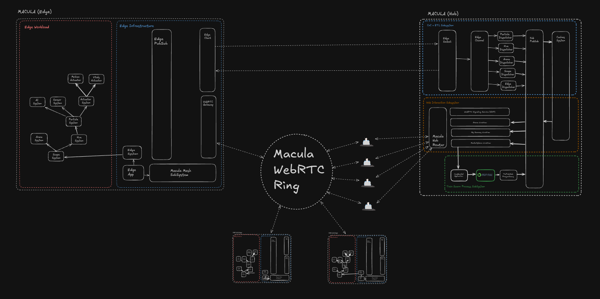

# Macula

## TL;DR

_Macula_ is Latin for "spot", referring to the nature of the kind of infrastructure this project is targeting: a decentralized and distributed mesh of tiny-node, low-cost, low-power clusters.

Since the current state of the Internet seems to manifest itself as a centralized, consolidated ecosystem of a limited number of hyper-scale platform providers, the so-called "Big Tech", it is easy to overlook that this is not the only possible formula that could be used to build meaningful and sustainable systems.

Indeed, one could argue that this centralized approach, mostly carried by extremely large & US-controlled corporations, is necessarily an optimal fit for other regions.

## OUTLINE

- [Macula](#macula)
  - [TL;DR](#tldr)
  - [OUTLINE](#outline)
  - [CHALLENGES](#challenges)
    - [Energy](#energy)
    - [Hardware](#hardware)
    - [Networking](#networking)
    - [Security](#security)
    - [Workloads](#workloads)
    - [Administration](#administration)
    - [Governance](#governance)
    - [Commercial Mindsets](#commercial-mindsets)
  - [Architecture](#architecture)
    - [Edge Nodes](#edge-nodes)
    - [Hub Nodes](#hub-nodes)
    - [Macula Ring](#macula-ring)

## CHALLENGES

It is important to understand that in order to build a truly decentralized and autonomous platform, the foundations of such a system must also be decentralized and autonomous, starting with power provisioning all the way up to the administration and governance of that system.

In practice, this means that platforms like _Macula_ must be built on top of a decentralized network of nodes, which must be able to communicate with each other, these nodes must be able to run workloads, which are themselves decentralized and autonomous.

### Energy

Decentralization of power provisioning is not an unknown field. Solar, wind or even small hydro generators can be used to power the nodes of a decentralized network, but they all suffer from the same problems as large-scale solutions: energy storage.  
Initiatives like [EnergyVision](https://energyvision.be), that offer investment-free consumer oriented solutions, would be an important pillar in serious attempts to decentralize power provisioning.

### Hardware

Single-board computers (SBCs), such as Raspberry Pi, Odroid, and NanoPC devices, are compact, energy-efficient systems that leverage ARM or x86 architectures to deliver modest computational power at minimal energy costs. These devices, often consuming under 15W per unit, are increasingly explored for building tiny-node clusters, enabling distributed computing for lightweight workloads like web servers, edge computing, IoT data aggregation, or prototyping scalable architectures. While SBC clusters offer advantages in power efficiency, physical footprint, and upfront cost—ideal for small businesses or startups with budget constraints—their commercial feasibility for mainstream enterprise operations remains limited.

Businesses requiring high-performance computing, low-latency processing, or heavy data workloads (e.g., AI training, large-scale databases) would struggle with SBC clusters due to hardware bottlenecks in CPU/GPU capabilities, storage speed, and network throughput. Additionally, scaling such clusters introduces logistical challenges in cooling, node synchronization, and maintenance, which may offset initial savings.-

However, niche applications like educational labs, localized edge networks, or low-traffic microservices could benefit from SBC clusters, provided operational demands align with their inherent constraints. Ultimately, while SBCs present innovative, cost-effective solutions for specific use cases, most enterprises would still require hybrid models blending traditional servers with SBC nodes to balance efficiency and performance.

### Networking

### Infrastructure

### Security

Securing a decentralized network of untrusted devices presents several significant challenges. One primary issue is the lack of a central authority, which makes it difficult to enforce uniform security protocols across all devices. This decentralization can lead to vulnerabilities, as each device might have different levels of security, potentially allowing malicious actors to exploit weaker nodes. Additionally, the dynamic nature of these networks, where devices frequently join and leave, complicates the maintenance of secure connections and trust relationships. Data integrity and privacy are also at risk, as intercepted or tampered data can compromise the entire network's security.

To imagine securing such networks, a multi-layered approach could be employed.

First, implementing robust encryption standards for all data transmissions would help protect against interception.

Second, using decentralized identity and authentication mechanisms, such as blockchain-based solutions, could verify the trustworthiness of devices before they join the network.

Third, continuous monitoring and real-time threat detection systems could be integrated to quickly identify and isolate compromised devices.

Finally, fostering a community-driven security model, where users and developers collaborate to share and implement security best practices, could enhance the overall resilience of the network against evolving threats.

[Interesting work in this field is being done by Nova Labs](https://youtu.be/c1DMN_mmRoQ?si=Z9ngoDn3JdJdgqUY)

### Workloads

### Administration

### Governance

### Commercial Mindsets

## ARCHITECTURE

_Macula_ is intended to run on a fractal topology network of tiny-node clusters, made of single-board computers (SBC). The network is designed to be highly decentralized, with no central authority or control, and to be self-healing and self-organizing.

### Edge Clusters

_Edge Nodes_ are the most basic unit of the network, and are responsible for running workloads, which should be hot-swappable and self-healing.

### Hub Clusters

_Hub Nodes_ provide local centralized services such as portals, dashboards, near-edge aggregation and -processing and are responsible for managing the edge nodes of their network.

### Macula Ring

WebRTC is a technology that enables peer-to-peer communication between devices, and it is the foundation of _Macula Rings_. Commonly used for peer-to-peer video and audio calls, it could also used to build temporary peer-to-peer networks for sharing data, or online collaboration, without putting extra load on Edge- or Hub Clusters.

## IDEAS

- [BEAM stack (AI generated)](ideas/analysis/root-beam.md)
